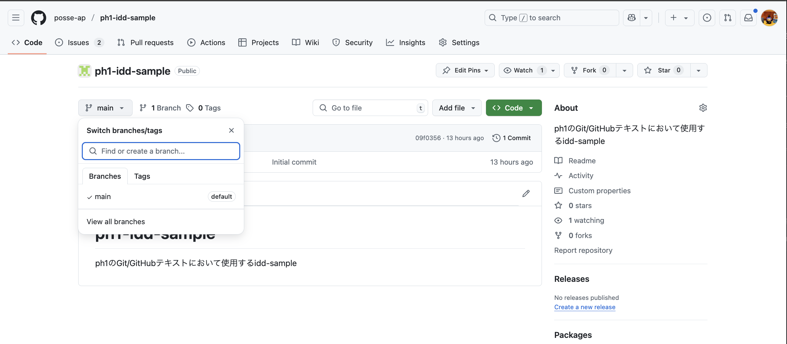
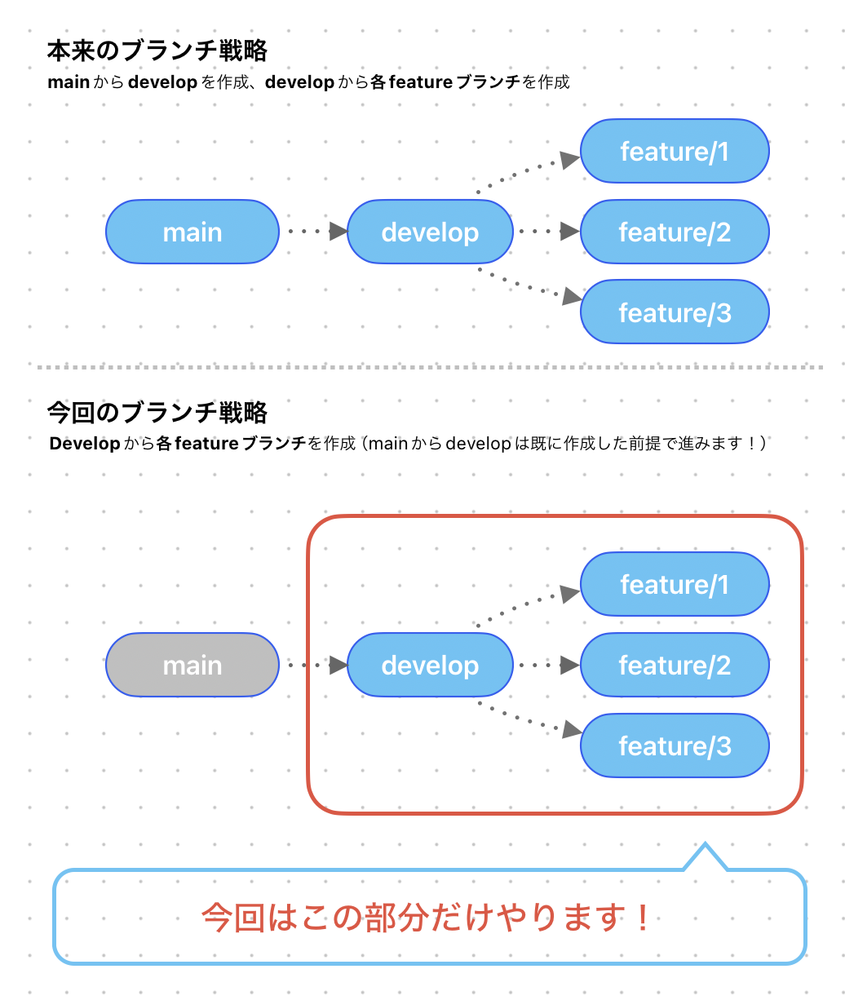

# 擬似issue駆動開発体験

- Level1,2,3で学んだことを理解している前提で説明が進みます！

## ここで体験すること

1. issueを作成する
2. issueをもとにブランチを作成する
3. PRを作成して依頼を出す
4. レビューを受ける
5. 親ブランチへ反映させる

擬似issue駆動開発体験では以下の画像のような開発サイクルを体験します。
これからのハッカソンやチーム開発で運用する手法なのでこの機会に頭へ叩き込みましょう！


---

## 1. issueを作成する

今回はこのようなタスクがあることを仮定します

### 「自己紹介の作成」

- 名前がある
- 在籍大学名がある

```text
趣旨はissue駆動開発の理解なので、タスクのクオリティはどの程度でも問題ないです
```

それではこのタスクに沿ってissueを作成してみましょう！

---

まずissuesタブを開いて、「New Issue」をクリックします


issue作成画面が出現するので、タスク内容を記載していきましょう！
`title`には「[あなたの名前]自己紹介文作成」、`description`には「名前と在籍大学名を記載する」と書いておけば何をするかが明確ですね！


```text
💡 迷ったらissueの一覧から他の人がどのようにissueを作成しているか参考にしてみましょう！
```

assign（誰に割り当てられたタスクなのか）も選択しましょう。今回は自分を選択します。


これでissueの作成は完了です！

## 2. issueをもとにブランチを作成する

issueを作成した際に番号が自動生成されます。その番号を元にブランチを作成するので、issueと作業ブランチが対応関係になります。


それでは実際にブランチを作成してみましょう！
「Code」タブをクリックして画面を移動します！


画面左側に「main」と書いてあるUIがあるのでクリックしましょう！



検索バーにブランチ名を入力することで新しくブランチが作成できます。
今回はissueの番号が「2」だったので、`feature/2`というブランチを作成します。
ここは各自作成したissueの番号を入力してください。


入力後「Create branch feature/? from main」をクリックすると、ブランチが作成されます。
もし誤った名称のブランチを作成してしまっても、新しく作り直せば問題ありません。

### 補足

本来はmainブランチ→developブランチ→作業ブランチと切り分けていきますが、あくまで擬似issue駆動開発体験なので、developブランチを切る工程は省略し、mainブランチから作業ブランチを作成します。



## 3. PRを作成して依頼を出す

PRを作成したらDiscordにてレビュー依頼をしましょう。
自分以外のメンバーにコードの変更をレビューしてもらうことで、客観的な視点でコードの改善点等を指摘してもらえます。

今回は縦モクの先輩に対してレビューを依頼します。
〇〇チャンネルでレビュー依頼をしましょう！

```text
PRをレビューしてもらってから親ブランチへ反映するという流れは一般的ですが、POSSE内部での開発全てに当てはまるとは限らないのでチームで確認しましょう
```

## 4. レビューを受ける

縦モクのタイミングで先輩からPRのapproveをもらいましょう！
この画面を先輩へ見せてください（どうしても先輩がいない場合は横モクの既にレビューをもらっているPRを見せてください）

### ■ 先輩に見てもらうところ

現在issue駆動開発をph1でやっています。
ph1にてPRの確認依頼を出しているため、approveをしてもらいたいです。
手順は以下の通りです。

コメントを書く

LGTM


## 5. 親ブランチへ反映させる

LGTMはもらえましたか？
実際に確認してみましょう！

## 最後に

カリキュラムの[「最後に」](https://github.com/posse-ap/curriculum/blob/6c7afdb7073b177c08b9b3a14fee0d9082e97b70/PH1/PH1_Git_GitHub_Level_3.md#%E6%9C%80%E5%BE%8C%E3%81%AB)に目を通してweek3は以上です！お疲れ様でした！

## Q&A

