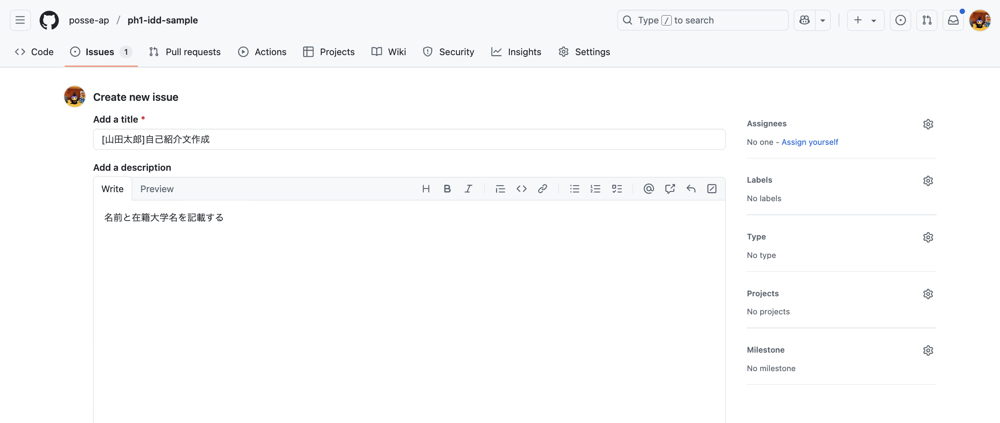
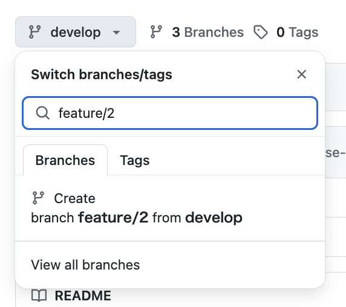

# 擬似issue駆動開発体験

- Level1,2,3で学んだことを理解している前提で説明が進みます！

## ここで体験すること

1. issueを作成する
2. issueをもとにブランチを作成する
3. PRを作成して依頼を出す
4. レビューを受ける
5. 親ブランチへ反映させる

擬似issue駆動開発体験では以下の画像のような開発サイクルを体験します。
これからのハッカソンやチーム開発で運用する手法なのでこの機会に頭へ叩き込みましょう！


---

## 1. issueを作成する

今回はこのようなタスクがあることを仮定します

### タスク

「自己紹介の作成」

- 名前がある

- 在籍大学名がある

```text
趣旨はissue駆動開発の理解なので、タスクのクオリティはどの程度でも問題ないです
```

それではこのタスクに沿ってissueを作成してみましょう！

---

まずissuesタブを開いて、「New Issue」をクリックします


issue作成画面が出現するので、タスク内容を記載していきましょう！
`title`には「[あなたの名前]自己紹介文作成」、`description`には「名前と在籍大学名を記載する」と書いておけば何をするかが明確ですね！




```text
💡 迷ったらissueの一覧から他の人がどのようにissueを作成しているか参考にしてみましょう！
```

「Assignees（誰に割り当てられたタスクなのか）」も選択しましょう。今回は自分を選択します。


これでissueの作成は完了です！

## 2. issueをもとにブランチを作成する

issueを作成した際に番号が自動生成されます。その番号を元にブランチを作成するので、issueと作業ブランチが対応関係になります。
今回は「2」という番号が自動生成されているので、`feature/2`というブランチを作成します！


それでは実際にブランチを作成してみましょう！
「Code」タブをクリックして画面を移動します！


画面左側に「main」と書いてあるボタンがあるのでクリックしましょう！


まずは作業ブランチをどのブランチから派生させるかを選択する必要があります！
今回はdevelopから派生させたいので、まずdevelopブランチをクリックしましょう！


検索バーにブランチ名を入力することで新しくブランチが作成できます。
繰り返しますが、今回はissueの番号が「2」だったので、`feature/2`というブランチを作成します。
ここは各自作成したissueの番号を入力してください。



入力後「Create branch feature/? from develop」をクリックすると、ブランチが作成されます。

「Create branch feature/? from `develop`」であって「Create branch feature/? from `main`」ではないので注意してください。
もし誤った名称のブランチを作成してしまっても、新しく作り直せば問題ありません。

### 補足

本来はmainブランチ→developブランチ→作業ブランチと切り分けていきますが、あくまで擬似issue駆動開発体験なので、mainブランチからdevelopブランチを切る工程は省略し、最初からdevelopブランチから作業ブランチを作成します。


## 3. PRを作成して依頼を出す

それでは実装に移ります！
先ほどcloneしたこのリポジトリをvscode上で立ち上げ、GitHub上で作成したブランチをローカルに反映させましょう！

```bash
git fetch
```

次に自分が作成したブランチへ移動します。

```bash
git checkout feature/?
```

すると画面左下が`feature/2`に変わりました！これは自分が作成したブランチへ移動できているということなので、実装の準備は完了しましたね！


### 実装

それでは **「新しく」ファイル** を作成し、実装していきましょう！
絶対新しく作成したファイル内で編集をしてください！既存のファイルをいじると、他の人が作成したファイルを編集してしまう可能性があります。


こんな感じで実装してみました！クオリティは求めないので、自由に編集してみてください！


実装が完了したらadd, commit, pushして編集した内容をGitHubに反映させましょう！
やり方は[Level 2 テキスト](https://github.com/posse-ap/curriculum/blob/main/PH1/PH1_Git_GitHub_Level_2.md#4-%E3%82%B3%E3%83%B3%E3%83%95%E3%83%AA%E3%82%AF%E3%83%88)を参考にしてください！

コマンドを打ち終わったらGitHubへ移動し、PRを作成しましょう！
PRの反映先は必ず`develop`にしてください！


```text
💡 作業ブランチは「develop」から切ったので反映するのも「develop」になります
基本的にはPRの反映先は切ったブランチ（親ブランチ）です
```

PRを作成したらDiscordにてレビュー依頼をしましょう。
自分以外のメンバーにコードの変更をレビューしてもらうことで、客観的な視点でコードの改善点等を指摘してもらえます。

今回は縦モクの先輩に対してレビューを依頼します。
PRのurlをコピーして、〇〇チャンネルでレビュー依頼をしましょう！


```text
PRをレビューしてもらってから親ブランチへ反映するという流れは一般的ですが、POSSE内部での開発全てに当てはまるとは限らないのでチームで確認しましょう
```

## 4. レビューを受ける

縦モクのタイミングで先輩からPRのLGTM（approve）をもらいましょう！
この画面を先輩へ見せてください（どうしても先輩がいない場合は横モクの既にレビューをもらっているPRを見せてください）

```text
💡 LGTMとはLooks Good To Meの略で、（レビュワー的にも）その実装でいいと思うよ！ということを伝えるメッセージになります
```

### ■ 先輩に見てもらうところ

先輩へ

現在issue駆動開発をph1でやっています。
ph1にてPRの確認依頼を出しているため、approveをしてもらいたいです。
やってほしいことは以下の2点です。

1. `LGTM`コメントを書く
2. コメントを書いたことを本人に伝える


## 5. 親ブランチへ反映させる

LGTMはもらえましたか？
LGTMがもらえたら、PRを親ブランチに反映させましょう！
Merge Pull Requestボタンをクリックして完了です！


実際に`develop`に反映されたか確認しましょう
`git checkout develop`でdevelopブランチへ移動して、もう一度VScodeで`git fetch`をして左のファイル一覧を見てみましょう！

feature/2で作成したファイルが反映されていますね！

最後にこのタスクが完了したことがわかるようにissueを閉じましょう！
画像にある通りissueタブからissueを選択し、「Close issue」をクリックして下さい！


これで擬似issue駆動開発体験は完了です！！！

## 最後に

カリキュラムの[「最後に」](https://github.com/posse-ap/curriculum/blob/6c7afdb7073b177c08b9b3a14fee0d9082e97b70/PH1/PH1_Git_GitHub_Level_3.md#%E6%9C%80%E5%BE%8C%E3%81%AB)に目を通してweek3は以上です！お疲れ様でした！
